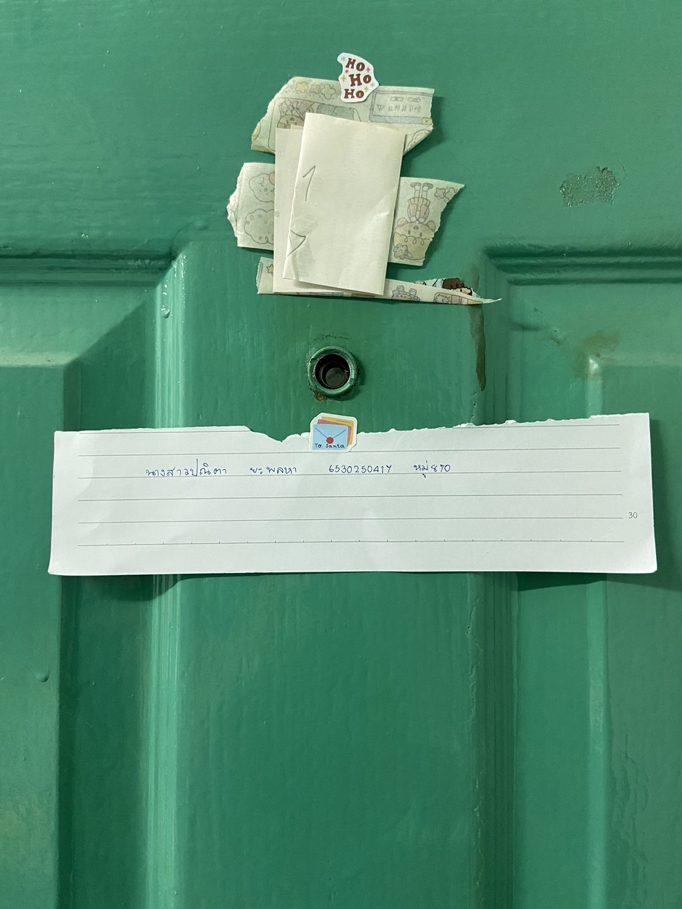

# Security Control
- ตาแมว
- Location
  - หอพัก
- Type Of Security Controls
  - Physical Controls
- Control Functions
  - Detective
- เหตุผล เพราะเป็นการตรวจสอบดูก่อนที่เราจะเปิดประตู ดูว่าใครมาหาเราหรือใครมาเรียกเรา เพื่อเป็นการป้องกันการโดนทำร้ายหรือผู้ไม่ประสงค์ดี เนื่องจากบ้างครั้งได้ยินเสียงเคาะประตูแต่ไม่รู้ว่าห้องเราไหมก็สามารถดูตาแมวเช็คได้โดยไม่ต้องเปิดประตูไปดู ทำให้ความสะดวกสบายมากขึ้น

<a href="https://panita18.github.io/"> Click </a>
